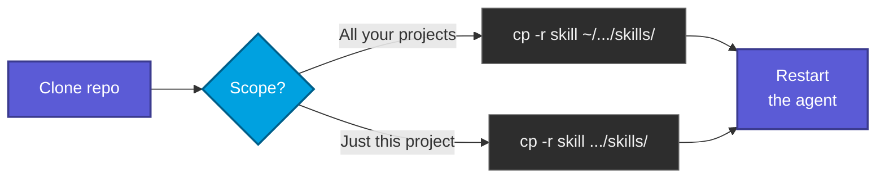

# decimatio-legio

> A collection of agent skills by Decimatio Dev, published openly under MIT.


Agent skills are reusable instruction packs that customise how an AI coding agent approaches specific domains. They are becoming a cross-vendor standard for AI assistants, so the contents of this repo should be portable in spirit even where the loading mechanics differ.

---

## Available skills

The catalogue is organised by domain. Today every skill targets Salesforce, so it lives under `decimatio-sf/`; future domains get sibling folders at the repo root.

| Skill | Domain | Target |
|---|---|---|
| **`decimatio-apex`** | Apex — syntax, security, SOQL/DML, triggers, async, testing, observability, SOLID | Summer '26 / API v67.0 |
| **`decimatio-lwc`** | LWC — template syntax, LDS, GraphQL, `@lwc/state`, dev tooling | Summer '26 / API v67.0 |
| **`decimatio-flow`** | Flow — flow types, bulkification, screen reactivity, security, Apex integration, callouts, testing | Summer '26 / API v67.0 |
| **`decimatio-aura`** | Aura components — when (not) to use, events, server/LDS, LWC interop | Summer '26 / API v67.0 |
| **`decimatio-visualforce`** | Visualforce — controller patterns, JavaScript Remoting | Summer '26 / API v67.0 |
| **`decimatio-lwr`** | Lightning Web Runtime — component portability, navigation, LWS/CSP, guest context | Summer '26 / API v67.0 |
| **`decimatio-lwr-sites`** | Experience Cloud LWR sites — enhanced sites, Grid/CMS, guest hardening, SEO | Summer '26 / API v67.0 |
| **`decimatio-lightning-out`** | Lightning Out 2.0 — embedding LWCs in non-Salesforce apps | Summer '26 / API v67.0 |
| **`decimatio-agentforce`** | Agentforce — agent anatomy (Topics/Instructions/Actions), Agent Script, Apex/Flow/Prompt actions, Data 360 grounding, Agent API, evals, Trust Layer | Summer '26 / API v67.0 |
| **`decimatio-data360`** | Data 360 (Data Cloud) — ingest→DLO→DMO→identity→insights→activation, ingestion/zero-copy, SOQL on DMOs, Query/Connect API, segments, credit governance | Summer '26 / API v67.0 |
| **`decimatio-headless360`** | Headless 360 — API/MCP/CLI surfaces, MCP server taxonomy, custom MCP tools, Experience Layer (HXL/AXL), headless DevOps, Trust Layer | Summer '26 / API v67.0 |
| **`decimatio-integration-overview`** | Integration decision hub — the six patterns, sync vs async, idempotency/retry, master decision matrix, authoring-surface map, API-version retirements | Summer '26 / API v67.0 |
| **`decimatio-integration-inbound-apis`** | Inbound standard APIs — REST/composite, SOAP, Bulk API 2.0, GraphQL, Connect/UI/Metadata/Tooling; choosing, batching, limits | Summer '26 / API v67.0 |
| **`decimatio-integration-inbound-apex`** | Custom inbound endpoints — Apex REST (`@RestResource`), Apex SOAP (legacy), Sites/Experience Cloud as integration surfaces, guest-user security | Summer '26 / API v67.0 |
| **`decimatio-integration-outbound`** | Outbound — Apex HTTP callouts and limits, async patterns, callout-after-DML, Flow HTTP Callout, External Services, Salesforce Connect, LWC proxy vs `fetch` | Summer '26 / API v67.0 |
| **`decimatio-integration-events`** | Event-driven — Platform Events, Change Data Capture, Pub/Sub API (gRPC), publish/subscribe from Apex/Flow, replay/retention, webhooks | Summer '26 / API v67.0 |
| **`decimatio-integration-auth`** | Integration auth and identity — inbound OAuth 2.0 flows, External Client Apps vs Connected Apps, JWT/mTLS, outbound Named/External Credentials | Summer '26 / API v67.0 |
| **`decimatio-integration-connectors-mcp`** | Connectors and agentic integration — MuleSoft (Anypoint / for Flow), Heroku/AppLink, ISV connectors, Data 360 as integration, Hosted MCP / Agent API | Summer '26 / API v67.0 |

Each skill loads **only on explicit invocation by name** (slash-command pattern) — none auto-trigger on generic Salesforce questions.

---

## Repository layout

```mermaid
graph TD
    Root([decimatio-legio/])
    Root --> Meta["README · CHANGELOG · LICENSE · .gitignore"]
    Root --> SF[decimatio-sf/]

    SF --> Apex[decimatio-apex/]
    SF --> LWC[decimatio-lwc/]
    SF --> Flow[decimatio-flow/]
    SF --> Aura[decimatio-aura/]
    SF --> VF[decimatio-visualforce/]
    SF --> LWR[decimatio-lwr/]
    SF --> LWRS[decimatio-lwr-sites/]
    SF --> LO[decimatio-lightning-out/]
    SF --> AF[decimatio-agentforce/]
    SF --> D360[decimatio-data360/]
    SF --> H360[decimatio-headless360/]

    SF --> IOV[decimatio-integration-overview/]
    SF --> IIA[decimatio-integration-inbound-apis/]
    SF --> IIX[decimatio-integration-inbound-apex/]
    SF --> IOUT[decimatio-integration-outbound/]
    SF --> IEV[decimatio-integration-events/]
    SF --> IAU[decimatio-integration-auth/]
    SF --> ICM[decimatio-integration-connectors-mcp/]

    classDef root fill:#5B5BD6,stroke:#3B3B8F,color:#fff,stroke-width:2px
    classDef domainFolder fill:#6E56CF,stroke:#3B3B8F,color:#fff,stroke-width:2px
    classDef skillFolder fill:#00A1E0,stroke:#005F8A,color:#fff,stroke-width:2px
    classDef meta fill:#F4F4F4,stroke:#999,color:#555

    class Root root
    class SF domainFolder
    class Apex,LWC,Flow,Aura,VF,LWR,LWRS,LO,AF,D360,H360,IOV,IIA,IIX,IOUT,IEV,IAU,ICM skillFolder
    class Meta meta
```



Each skill folder contains its `SKILL.md` (the load-bearing instructions) plus a `references/` subfolder with verbatim implementations and large code examples that the agent loads on demand. Repo-level files (`README.md`, `CHANGELOG.md`, `LICENSE`, `.gitignore`) live at the root and never get bundled into the installable skill.

---

## Install as a `.skill` bundle

A `.skill` file is just a ZIP archive of the skill folder with the extension renamed. The **skill folder itself must be the archive's top-level entry** — unzipping has to yield `decimatio-lwc/SKILL.md`, never a double-nested path like `decimatio-sf/decimatio-lwc/SKILL.md`.

**Pre-built bundles for every skill live at the repository root** (one `decimatio-<name>.skill` per skill folder under `decimatio-sf/`). Download the `.skill` you need and upload it to whichever assistant supports the format — no zipping required on your side.


> The bundles are regenerated alongside every change to the source skill folder and committed to the repo. If you edit a `SKILL.md` and want a fresh bundle, see [Rebuilding a bundle](#rebuilding-a-bundle) below.

### Rebuilding a bundle

From the repository root, the skill folder — not its parent — must become the archive root.

**Terminal — macOS, Linux, WSL (Bash / Git Bash):**

```bash
cd decimatio-sf
zip -r ../decimatio-apex.skill decimatio-apex/
```

`zip` is preinstalled on macOS and almost every Linux distro.

**Terminal — PowerShell (Windows):**

The plain `Compress-Archive` cmdlet writes Windows-style backslash separators into the ZIP entry names, which fails strict parsers (e.g. Claude Desktop's skill import). Use `System.IO.Compression.ZipArchive` directly to force forward-slash entry names:

```powershell
Add-Type -AssemblyName System.IO.Compression
Add-Type -AssemblyName System.IO.Compression.FileSystem

$skill = "decimatio-apex"
$src   = "decimatio-sf\$skill"
$dest  = "$skill.skill"

if (Test-Path -LiteralPath $dest) { Remove-Item -LiteralPath $dest }

$zip = [System.IO.Compression.ZipFile]::Open($dest, [System.IO.Compression.ZipArchiveMode]::Create)
Get-ChildItem -Path $src -Recurse -File | ForEach-Object {
    $inner = $_.FullName.Substring($src.Length + 1) -replace '\\', '/'
    $entry = $zip.CreateEntry("$skill/$inner", [System.IO.Compression.CompressionLevel]::Optimal)
    $fs = $entry.Open()
    $src2 = [System.IO.File]::OpenRead($_.FullName)
    $src2.CopyTo($fs)
    $src2.Close()
    $fs.Close()
}
$zip.Dispose()
```

**macOS Finder** — Right-click the skill folder → **Compress [folder name]** → rename the resulting `.zip` to `.skill`.

> If Finder hides extensions, enable them first: **Finder → Settings → Advanced → Show all filename extensions**.

**Linux file manager (GNOME Files, KDE Dolphin, others)** — Right-click the skill folder → **Compress…** / **Create archive…** → choose ZIP format → rename the resulting `.zip` to `.skill`.

**Windows Explorer** — Right-click the skill folder → **Compress to ZIP file** → rename the resulting `.zip` to `.skill`.

---

## Install from disk

Agents that read skills directly from a folder on disk need no zipping — copy the skill folder into the directory matching the scope you want:



After copying, restart the agent and verify the skill appears under its loaded-skills list.

---

## License

[MIT](LICENSE)
