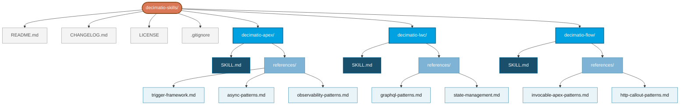
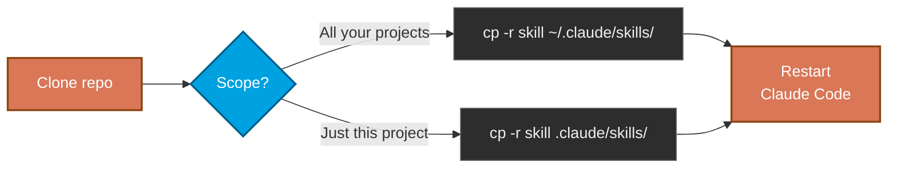

# decimatio-skills

> A collection of Claude Skills by Decimatio Dev, published openly under MIT.


Claude Skills are reusable instruction packs that customise how Claude approaches specific domains. They are becoming a cross-vendor standard for AI assistants, so the contents of this repo should be portable in spirit even where the loading mechanics differ.

---

## Available skills

| Skill | Domain | Target |
|---|---|---|
| **`decimatio-apex`** | Salesforce Apex — syntax, security, SOQL/DML, triggers, async, testing, observability | Summer '26 / API v67.0 |
| **`decimatio-lwc`** | Salesforce LWC — template syntax, LDS, GraphQL, state management, dev tooling | Summer '26 / API v67.0 |
| **`decimatio-flow`** | Salesforce Flow — flow types, bulkification, screen reactivity, security, Apex integration, HTTP callouts, testing | Summer '26 / API v67.0 |

Each skill loads **only on explicit invocation by name** (slash-command pattern) — they do not auto-trigger on generic Apex, LWC, or Flow questions.

---

## Repository layout



Each skill folder contains its `SKILL.md` (the load-bearing instructions) plus a `references/` subfolder with verbatim implementations and large code examples that Claude loads on demand. Repo-level files (`README.md`, `CHANGELOG.md`, `LICENSE`, `.gitignore`) live at the root and never get bundled into the installable skill.

---

## Install in Claude.ai

A `.skill` file is just a ZIP archive of the skill folder with the extension renamed. Build it once, upload it once.


Upload location in Claude.ai: **Settings → Capabilities → Skills → Upload skill**.

### Terminal — macOS, Linux, WSL

```bash
zip -r decimatio-apex.skill decimatio-apex/
```

The `zip` command is preinstalled on macOS and almost every Linux distro.

### macOS Finder

Right-click the skill folder → **Compress [folder name]** → rename the resulting `.zip` to `.skill`.

> If Finder hides extensions, enable them first: **Finder → Settings → Advanced → Show all filename extensions**.

### Linux file manager (GNOME Files, KDE Dolphin, others)

Right-click the skill folder → **Compress…** / **Create archive…** → choose ZIP format → rename the resulting `.zip` to `.skill`.

### Windows Explorer

Right-click the skill folder → **Compress to ZIP file** → rename the resulting `.zip` to `.skill`.

---

## Install in Claude Code

Claude Code reads skills directly from a folder on disk — no zipping needed. Copy the skill folder into the directory matching the scope you want:



After copying, restart Claude Code and verify with `claude doctor` — the skill should appear under **Loaded Skills**.

---

## License

[MIT](LICENSE)
