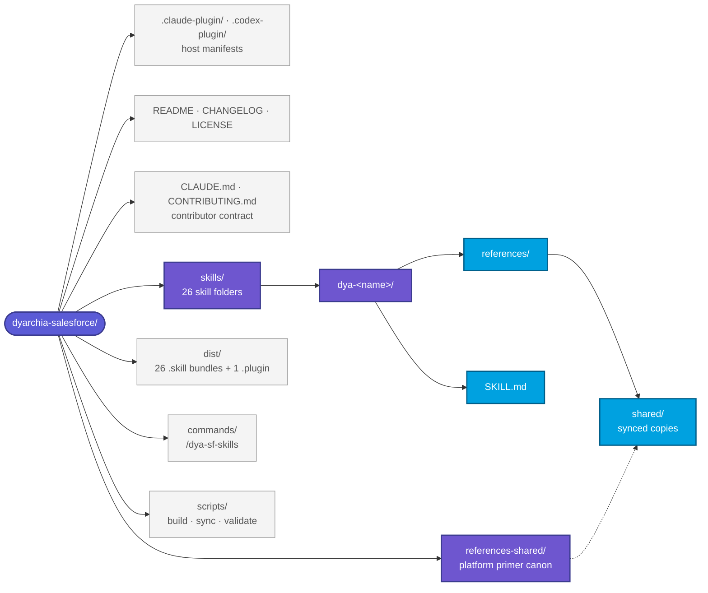
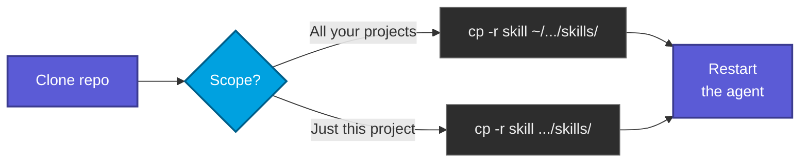

# dyarchia-salesforce

> Salesforce agent skills by Dyarchia, published openly under MIT.


Agent skills are reusable instruction packs that customise how an AI coding agent approaches specific domains. They are becoming a cross-vendor standard for AI assistants, so the contents of this repo should be portable in spirit even where the loading mechanics differ.

Every skill loads **only on explicit invocation by name** — none auto-trigger on generic Salesforce questions.

That makes them undiscoverable on purpose, so the plugin ships **`/dya-sf-skills`**: run it to print the catalogue with what each skill covers, then invoke the one you want by name. Add a word to filter — `/dya-sf-skills integration`.

---

## Available skills

26 skills, all targeting **Winter '27 / API v68.0**, under `skills/`. Other Dyarchia domains live in sibling repositories under the same organisation — one repo per domain, one plugin per repo.

### Core development

- **`dya-apex`**
  Syntax, security, SOQL/DML, triggers, async, testing, observability, SOLID.
- **`dya-lwc`**
  Template syntax, LDS, GraphQL, `@lwc/state`, dev tooling, Jest.
- **`dya-flow`**
  Flow types, bulkification, screen reactivity, security, Apex integration, callouts, testing.

### Maintenance-mode UI

- **`dya-aura`**
  When (not) to use Aura, events, server/LDS, LWC interop.
- **`dya-visualforce`**
  Controller patterns, view state, JavaScript Remoting, PDF/email rendering.

### Runtime and sites

- **`dya-lwr`**
  Lightning Web Runtime — component portability, navigation, LWS/CSP, guest context.
- **`dya-lwr-sites`**
  Experience Cloud LWR sites — enhanced sites, Grid/CMS, guest hardening, SEO.
- **`dya-lightning-out`**
  Lightning Out 2.0 — embedding LWCs in non-Salesforce apps.

### AI and data

- **`dya-agentforce`**
  Agent anatomy (Topics/Instructions/Actions), Agent Script, Apex/Flow/Prompt actions, Data 360 grounding, Agent API, evals, Trust Layer.
- **`dya-data360`**
  Data 360 (Data Cloud) — ingest→DLO→DMO→identity→insights→activation, zero-copy, SOQL on DMOs, Query/Connect API, segments, credit governance.
- **`dya-headless360`**
  API/MCP/CLI surfaces, MCP server taxonomy, custom MCP tools, Experience Layer (HXL/AXL), headless DevOps.

### Product and industry clouds

- **`dya-b2b-commerce`**
  B2B/D2C Commerce on core — CartExtension framework, endpoint extensions, `ConnectApi.CommerceCart`, buyer groups.
- **`dya-b2c-commerce`**
  B2C Commerce (Demandware lineage) — `dw.*` Script API, SFRA cartridges, Composable Storefront, SCAPI/SLAS.
- **`dya-field-service`**
  FSL Apex namespace, scheduling and booking patterns, Scheduler REST, ServiceAppointment lifecycle, mobile extensibility.
- **`dya-omni-channel`**
  Service Cloud routing — the work-item-to-agent chain, presence and capacity, skills-based routing, the `routeWork` Agentforce seam.
- **`dya-omnistudio`**
  OmniScripts, FlexCards, Integration Procedures, DataRaptors, Apex Remote Actions.
- **`dya-revenue-cloud`**
  Revenue Cloud Advanced / RLM — Product Catalog, Salesforce Pricing, Transaction Management, Asset Lifecycle, Billing.

### Platform model and tooling

- **`dya-permissions`**
  Profiles, permission sets and groups, OWD and sharing, restriction/scoping rules, FLS, Apex user mode.
- **`dya-sf-cli`**
  `sf` command catalog — auth, deploy/retrieve, scratch orgs, Apex/data, Agentforce DX, packaging.

### Integration family

- **`dya-integration-overview`**
  Decision hub — the six patterns, sync vs async, idempotency/retry, master decision matrix, authoring-surface map.
- **`dya-integration-inbound-apis`**
  REST/composite, SOAP, Bulk API 2.0, GraphQL, Connect/UI/Metadata/Tooling; choosing, batching, limits.
- **`dya-integration-inbound-apex`**
  Apex REST (`@RestResource`), Apex SOAP (legacy), Sites/Experience Cloud as integration surfaces, guest-user security.
- **`dya-integration-outbound`**
  Apex HTTP callouts and limits, async patterns, callout-after-DML, Flow HTTP Callout, External Services, Salesforce Connect.
- **`dya-integration-events`**
  Platform Events, Change Data Capture, Pub/Sub API (gRPC), publish/subscribe from Apex and Flow, replay/retention, webhooks.
- **`dya-integration-auth`**
  Inbound OAuth 2.0 flows, External Client Apps vs Connected Apps, JWT/mTLS, outbound Named/External Credentials.
- **`dya-integration-connectors-mcp`**
  MuleSoft (Anypoint / for Flow), Heroku/AppLink, ISV connectors, Data 360 as integration, Hosted MCP / Agent API.

---

## Repository layout



Each skill folder contains its `SKILL.md` (the load-bearing instructions) plus a `references/` subfolder with verbatim implementations and large code examples that the agent loads on demand. Repo-level files never get bundled into the installable skill.

`references-shared/` holds the platform fundamentals — governor limits, the access model, API-version semantics — written once. A skill lists the fragments it needs in its own `shared-refs.txt`, and `scripts/sync-shared-refs` copies them into `references/shared/`. The copies are committed so every bundle stays self-contained; the canon is what you edit.

`agents/`, `hooks/` and `mcp/` are reserved by convention and not present yet.

---

## Install as a Claude Code plugin

The repository is its own marketplace, so all 26 skills install in one step:

```bash
/plugin marketplace add Dyarchia/dyarchia-salesforce
```

```bash
/plugin install dyarchia-salesforce@dyarchia-salesforce
```

The plugin and the marketplace share a name because this repository is both: one repo per domain, one plugin per repo. Sibling Dyarchia domains ship their own repository and their own marketplace, so the two can be installed side by side without colliding.

Skills are discovered from `skills/` automatically. No MCP servers are declared — wire your own if you use them.

---

## Install in Claude Desktop

Claude Desktop imports a **plugin archive**, not a skill bundle. Download [`dist/dyarchia-salesforce.plugin`](dist) and import it — one file, all 26 skills.

It accepts only `.zip` and `.plugin` extensions, and the archive must carry a `.claude-plugin/plugin.json` at its root. The per-skill `.skill` bundles satisfy neither: they are rooted at `<skill-name>/` and carry no manifest, so importing one fails with *"The archive must contain a .claude-plugin/plugin.json manifest, or a top-level SKILL.md"*. Renaming a `.skill` to `.zip` does not help — use the `.plugin`.

```bash
pwsh -NoProfile -File scripts/build-plugin.ps1
```

```bash
scripts/build-plugin.sh
```

---

## Install on other agents

The skills themselves are not Claude-specific. Each is a folder with a `SKILL.md` carrying `name` and `description` in YAML frontmatter — the [Agent Skills](https://agentskills.io) shape that several vendors now read. Only the manifests differ, and both live at the repository root:

```text
.claude-plugin/     plugin.json + marketplace.json
.codex-plugin/      plugin.json
skills/             the content, shared by both
```

- **Grok (xAI)** needs nothing. It reads Claude Code marketplaces, plugins, skills, MCP servers, agents, hooks and `CLAUDE.md` alongside its own `.grok/`, so clone the repo or install it as a plugin and it works as-is.
- **Codex / ChatGPT** reads `.codex-plugin/plugin.json`, which points at the same `skills/` tree. Add the folder to a local marketplace with `@plugin-creator`, then install it.
- **Mistral Vibe** takes the skill folders directly — it implements the same Agent Skills standard.
- **Anything that reads `.agents/skills/`** (Codex and Grok both do, at repo and user level) will find the skills if you symlink or copy `skills/` there.

The two manifests duplicate the plugin name, version and description, so `scripts/validate-skills` checks them against each other and fails when they drift.

Gemini has no equivalent plugin-and-skill surface at the time of writing; use the `.skill` bundles or paste what you need.

---

## Install as a `.skill` bundle

For assistants that take skill archives rather than Claude Code plugins.

A `.skill` file is a ZIP archive of the skill folder with the extension renamed. The **skill folder itself must be the archive's top-level entry** — unzipping has to yield `dya-lwc/SKILL.md`, never a double-nested path like `skills/dya-lwc/SKILL.md`.

**Pre-built bundles for every skill live in [`dist/`](dist).** Download the `.skill` you need and upload it to whichever assistant supports the format — no zipping required on your side.


> The bundles are regenerated alongside every change to the source skill folder and committed to the repo.

### Rebuilding a bundle

Use the packaging scripts. They root the archive at the skill folder and force forward-slash entry names, which the plain `Compress-Archive` cmdlet does not — it writes Windows backslashes that strict parsers (Claude Desktop's skill import) reject with *"Zip file contains path with invalid characters"*.

**macOS, Linux, WSL, Git Bash:**

```bash
scripts/build-skill.sh dya-apex
```

**PowerShell 7+ (Windows):**

```powershell
pwsh -NoProfile -File scripts/build-skill.ps1 dya-apex
```

Omit the skill name to rebuild every bundle. Then verify that sources, bundles and this catalogue all agree:

```bash
scripts/validate-skills.sh
```

```powershell
pwsh -NoProfile -File scripts/validate-skills.ps1
```

The validator checks frontmatter, the explicit-invocation clause, ZIP entry naming, per-file content hashes between each bundle and its source, and README coverage. It exits non-zero on any mismatch.

---

## Install from disk

Agents that read skills directly from a folder on disk need no zipping — copy the skill folder into the directory matching the scope you want:



After copying, restart the agent and verify the skill appears under its loaded-skills list.

---

## Contributing to this repo

### Branches

Work flows in one direction: **feature → `develop` → `master`**.

- **Branch from `develop`.** It is the working branch and always carries the current state.
- **Open the pull request against `develop`.** GitHub proposes `master` because that is the
  repository's default branch, so the base has to be changed by hand on every pull request.
- **`master` is the published branch.** It is synced from `develop` after a merge; nothing lands on
  it directly.

If a clone or worktree predates a change of default branch, its `refs/remotes/origin/HEAD` is stale
and `git checkout` on the bare default gives you the wrong branch. Fix the ref rather than working
around it:

```bash
git remote set-head origin -a
```

### Skills

Every skill is a folder under `skills/` holding a `SKILL.md` and, optionally, a `references/` subfolder for material consulted on demand rather than obeyed on every invocation. The frontmatter carries two keys: `name`, identical to the folder name, and `description`, which ends with the explicit-invocation clause that keeps the skill from auto-triggering.

Shared fundamentals are never copy-pasted between skills. Edit the canon under `references-shared/`, list the fragment in the skill's `shared-refs.txt`, and run `scripts/sync-shared-refs`; editing a synced copy directly is a validation error.

The full contract lives in [`CLAUDE.md`](CLAUDE.md), and the step-by-step procedure for adding, editing, splitting or removing a skill lives in [`CONTRIBUTING.md`](CONTRIBUTING.md). Both are versioned: read them before your first change rather than inferring the conventions from the diff.

A source edit is only half the change. Rebuild that skill's bundle with `scripts/build-skill`, then run `scripts/validate-skills`. Beyond comparing every bundle against its source file by file, it checks that every skill's Platform Context declares the platform version this README states, that `plugin.json` and `marketplace.json` agree on the plugin version, that no `references/` file is left uncited, and that every synced fragment still matches its canon. It must exit 0 before any commit that touches `skills/`.

---

## License

[MIT](LICENSE)
