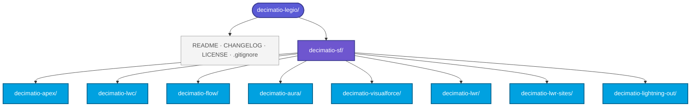
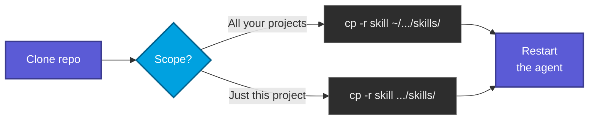

# decimatio-legio

> A collection of agent skills by Decimatio Dev, published openly under MIT.


Agent skills are reusable instruction packs that customise how an AI coding agent approaches specific domains. They are becoming a cross-vendor standard for AI assistants, so the contents of this repo should be portable in spirit even where the loading mechanics differ.

---

## Available skills

The catalogue is organised by domain. Today every skill targets Salesforce, so it lives under `decimatio-sf/`; future domains get sibling folders at the repo root.

| Skill | Domain | Target |
|---|---|---|
| **`decimatio-apex`** | Apex — syntax, security, SOQL/DML, triggers, async, testing, observability, SOLID | Summer '26 / API v67.0 |
| **`decimatio-lwc`** | LWC — template syntax, LDS, GraphQL, `@lwc/state`, dev tooling | Summer '26 / API v67.0 |
| **`decimatio-flow`** | Flow — flow types, bulkification, screen reactivity, security, Apex integration, callouts, testing | Summer '26 / API v67.0 |
| **`decimatio-aura`** | Aura components — when (not) to use, events, server/LDS, LWC interop | Summer '26 / API v67.0 |
| **`decimatio-visualforce`** | Visualforce — controller patterns, JavaScript Remoting | Summer '26 / API v67.0 |
| **`decimatio-lwr`** | Lightning Web Runtime — component portability, navigation, LWS/CSP, guest context | Summer '26 / API v67.0 |
| **`decimatio-lwr-sites`** | Experience Cloud LWR sites — enhanced sites, Grid/CMS, guest hardening, SEO | Summer '26 / API v67.0 |
| **`decimatio-lightning-out`** | Lightning Out 2.0 — embedding LWCs in non-Salesforce apps | Summer '26 / API v67.0 |

Each skill loads **only on explicit invocation by name** (slash-command pattern) — none auto-trigger on generic Salesforce questions.

---

## Repository layout



Each skill folder contains its `SKILL.md` (the load-bearing instructions) plus a `references/` subfolder with verbatim implementations and large code examples that the agent loads on demand. Repo-level files (`README.md`, `CHANGELOG.md`, `LICENSE`, `.gitignore`) live at the root and never get bundled into the installable skill.

---

## Install as a `.skill` bundle

A `.skill` file is just a ZIP archive of the skill folder with the extension renamed. Build it once, upload it once into whichever assistant supports the format.


### Terminal — macOS, Linux, WSL

```bash
zip -r decimatio-apex.skill decimatio-sf/decimatio-apex/
```

The `zip` command is preinstalled on macOS and almost every Linux distro.

### macOS Finder

Right-click the skill folder → **Compress [folder name]** → rename the resulting `.zip` to `.skill`.

> If Finder hides extensions, enable them first: **Finder → Settings → Advanced → Show all filename extensions**.

### Linux file manager (GNOME Files, KDE Dolphin, others)

Right-click the skill folder → **Compress…** / **Create archive…** → choose ZIP format → rename the resulting `.zip` to `.skill`.

### Windows Explorer

Right-click the skill folder → **Compress to ZIP file** → rename the resulting `.zip` to `.skill`.

---

## Install from disk

Agents that read skills directly from a folder on disk need no zipping — copy the skill folder into the directory matching the scope you want:



After copying, restart the agent and verify the skill appears under its loaded-skills list.

---

## License

[MIT](LICENSE)
