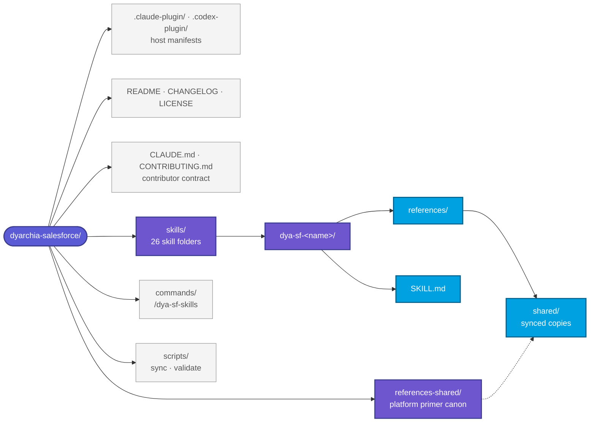
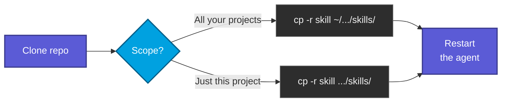

# dyarchia-salesforce

> Salesforce agent skills by Dyarchia, published openly under MIT.


Agent skills are reusable instruction packs that customise how an AI coding agent handles a domain. They are becoming a cross-vendor standard, so these skills aim to be portable even where loading mechanics differ.

Every skill loads **before the agent creates or edits anything in its scope** — `dya-sf-apex` before an Apex class or trigger, `dya-sf-flow` before a flow — or when invoked by name. A Salesforce question that changes no code loads nothing.

**`/dya-sf-skills`** prints the catalogue with what each skill covers; add a word to filter, as in `/dya-sf-skills integration`.

---

## Available skills

26 skills, all targeting **Winter '27 / API v68.0**, under `skills/`. Other Dyarchia domains live in sibling repositories under the same organisation — one repo per domain, one plugin per repo.

Two skills are exempt from that version, as their Platform Context states: **`dya-sf-b2c-commerce`**, the Demandware-lineage platform with no Salesforce core API version, and **`dya-sf-cli`**, which tracks the CLI's weekly cadence. The validator allowlists both.

### Core development

- **`dya-sf-apex`**
  Syntax, security, SOQL/DML, triggers, async, testing, observability, SOLID.
- **`dya-sf-lwc`**
  Template syntax, LDS, GraphQL, `@lwc/state`, dev tooling, Jest.
- **`dya-sf-flow`**
  Flow types, bulkification, screen reactivity, security, Apex integration, callouts, testing.

### Maintenance-mode UI

- **`dya-sf-aura`**
  When (not) to use Aura, events, server/LDS, LWC interop.
- **`dya-sf-visualforce`**
  Controller patterns, view state, JavaScript Remoting, PDF/email rendering.

### Runtime and sites

- **`dya-sf-lwr`**
  Lightning Web Runtime — component portability, navigation, LWS/CSP, guest context.
- **`dya-sf-lwr-sites`**
  Experience Cloud LWR sites — enhanced sites, Grid/CMS, guest hardening, SEO.
- **`dya-sf-lightning-out`**
  Lightning Out 2.0 — embedding LWCs in non-Salesforce apps.

### AI and data

- **`dya-sf-agentforce`**
  Zero to expert — org setup and agent user, agent design, the complete Agent Script language and its patterns, every action type, knowledge and data libraries, Agent API, testing and custom scorers, observability, voice, troubleshooting, Trust Layer.
- **`dya-sf-data360`**
  Data 360 (Data Cloud) — ingest→DLO→DMO→identity→insights→activation, zero-copy, SOQL on DMOs, Query/Connect API, segments, credit governance.
- **`dya-sf-headless360`**
  API/MCP/CLI surfaces, MCP server taxonomy, custom MCP tools, Experience Layer (HXL/AXL), headless DevOps.

### Product and industry clouds

- **`dya-sf-b2b-commerce`**
  B2B/D2C Commerce on core — CartExtension framework, endpoint extensions, `ConnectApi.CommerceCart`, buyer groups.
- **`dya-sf-b2c-commerce`**
  B2C Commerce (Demandware lineage) — `dw.*` Script API, SFRA cartridges, Composable Storefront, SCAPI/SLAS.
- **`dya-sf-field-service`**
  FSL Apex namespace, scheduling and booking patterns, Scheduler REST, ServiceAppointment lifecycle, mobile extensibility.
- **`dya-sf-omni-channel`**
  Service Cloud routing — the work-item-to-agent chain, presence and capacity, skills-based routing, the `routeWork` Agentforce seam.
- **`dya-sf-omnistudio`**
  OmniScripts, FlexCards, Integration Procedures, DataRaptors, Apex Remote Actions.
- **`dya-sf-revenue-cloud`**
  Revenue Cloud Advanced / RLM — Product Catalog, Salesforce Pricing, Transaction Management, Asset Lifecycle, Billing.

### Platform model and tooling

- **`dya-sf-permissions`**
  Profiles, permission sets and groups, OWD and sharing, restriction/scoping rules, FLS, Apex user mode.
- **`dya-sf-cli`**
  `sf` command catalog — auth, deploy/retrieve, scratch orgs, Apex/data, Agentforce DX, packaging.

### Integration family

- **`dya-sf-integration-overview`**
  Decision hub — the six patterns, sync vs async, idempotency/retry, master decision matrix, authoring-surface map.
- **`dya-sf-integration-inbound-apis`**
  REST/composite, SOAP, Bulk API 2.0, GraphQL, Connect/UI/Metadata/Tooling; choosing, batching, limits.
- **`dya-sf-integration-inbound-apex`**
  Apex REST (`@RestResource`), Apex SOAP (legacy), Sites/Experience Cloud as integration surfaces, guest-user security.
- **`dya-sf-integration-outbound`**
  Apex HTTP callouts and limits, async patterns, callout-after-DML, Flow HTTP Callout, External Services, Salesforce Connect.
- **`dya-sf-integration-events`**
  Platform Events, Change Data Capture, Pub/Sub API (gRPC), publish/subscribe from Apex and Flow, replay/retention, webhooks.
- **`dya-sf-integration-auth`**
  Inbound OAuth 2.0 flows, External Client Apps vs Connected Apps, JWT/mTLS, outbound Named/External Credentials.
- **`dya-sf-integration-connectors-mcp`**
  MuleSoft (Anypoint / for Flow), Heroku/AppLink, ISV connectors, Data 360 as integration, Hosted MCP / Agent API.

---

## Repository layout


```mermaid
graph LR
    Root([dyarchia-salesforce/])
    Root --> Plugin[".claude-plugin/ · .codex-plugin/<br/>host manifests"]
    Root --> Meta["README · CHANGELOG · LICENSE"]
    Root --> Contract["CLAUDE.md · CONTRIBUTING.md<br/>contributor contract"]
    Root --> SK["skills/<br/>26 skill folders"]
    Root --> Shared["references-shared/<br/>platform primer canon"]
    Root --> Cmds["commands/<br/>/dya-sf-skills"]
    Root --> Scripts["scripts/<br/>sync · validate"]

    SK --> Skill["dya-sf-&lt;name&gt;/"]
    Skill --> SM["SKILL.md"]
    Skill --> Refs["references/"]
    Refs --> SharedRefs["shared/<br/>synced copies"]
    Shared -.-> SharedRefs

    classDef root fill:#5B5BD6,stroke:#3B3B8F,color:#fff,stroke-width:2px
    classDef domainFolder fill:#6E56CF,stroke:#3B3B8F,color:#fff,stroke-width:2px
    classDef skillFolder fill:#00A1E0,stroke:#005F8A,color:#fff,stroke-width:2px
    classDef meta fill:#F4F4F4,stroke:#999,color:#555

    class Root root
    class SK,Skill,Shared domainFolder
    class SM,Refs,SharedRefs skillFolder
    class Plugin,Meta,Contract,Scripts,Cmds meta
```

Each skill folder holds its `SKILL.md` (the load-bearing instructions) and a `references/` subfolder of verbatim implementations and large code examples, loaded on demand.

`references-shared/` holds the platform fundamentals (governor limits, the access model, API-version semantics), written once. A skill lists the ones it needs in its `shared-refs.txt`, and `scripts/sync-shared-refs` copies them into `references/shared/`. A skill the canon does not apply to has no such file; today that is only `dya-sf-b2c-commerce`, since nothing on that platform is Salesforce core. The copies are committed so every skill folder stays self-contained; edit the canon, not the copies.

`agents/`, `hooks/` and `mcp/` are reserved by convention and not present yet.

---

## Install as a Claude Code plugin

The repository is its own marketplace, so all 26 skills install in one step:

```bash
/plugin marketplace add Dyarchia/dyarchia-salesforce
```

```bash
/plugin install dyarchia-salesforce@dyarchia-salesforce
```

The plugin and marketplace share a name because this repository is both. Sibling Dyarchia domains ship their own repository and marketplace, so they install side by side without colliding.

Skills are discovered from `skills/` automatically. No MCP servers are declared — wire your own.

### Keep it updated

Claude Code turns auto-update **off** for third-party marketplaces, so a new release reaches you only after one of these:

- **Automatically.** Run `/plugin`, open **Marketplaces**, select `dyarchia-salesforce` and choose **Enable auto-update**. Each session then checks for a new release a few minutes after your first message and installs it; it loads on your next session, or after `/reload-plugins`.
- **Now, by hand.** Refreshing the marketplace only refreshes its catalogue; updating the plugin is a second step. From a shell:

```bash
claude plugin marketplace update dyarchia-salesforce
```

```bash
claude plugin update dyarchia-salesforce@dyarchia-salesforce
```

Then run `/reload-plugins` or start a new session. Inside a terminal session, `/plugin` → **Marketplaces** → **Update marketplace** does both steps at once. The Claude desktop app's **Update** button lights up only after the marketplace catalogue has been refreshed, which is why it stays grey while auto-update is off.

---

## Install on other agents

The skills are not Claude-specific. Each is a folder with a `SKILL.md` carrying `name` and `description` in YAML frontmatter, the [Agent Skills](https://agentskills.io) shape several vendors read. Only the manifests differ, at the repository root:

```text
.claude-plugin/     plugin.json + marketplace.json
.codex-plugin/      plugin.json
skills/             the content, shared by both
```

The quickest route to any agent is the [`skills`](https://github.com/vercel-labs/skills) CLI, which reads `skills/` directly and supports Claude Code, Codex, Cursor, OpenCode and dozens more. It opens a picker for which skills, which agents, project or global scope, and symlink or copy:

```bash
npx skills add Dyarchia/dyarchia-salesforce
```

Add `--list` to see the catalogue without installing, `--skill <name>` to take one skill, `--agent <agent>` to pick a target, `-g` for user scope and `-y` to skip the prompts. Each skill carries its own copy of the shared references, so any subset installs complete.

Per agent, without the CLI:

- **Grok (xAI)** needs nothing. It reads Claude Code marketplaces, plugins, skills, MCP servers, agents, hooks and `CLAUDE.md` alongside its own `.grok/`; clone the repo or install it as a plugin.
- **Codex / ChatGPT** reads `.codex-plugin/plugin.json`, which points at the same `skills/` tree. Add the folder to a local marketplace with `@plugin-creator`, then install it.
- **Mistral Vibe** implements the Agent Skills standard and takes the skill folders directly.
- **Anything that reads `.agents/skills/`** (Codex and Grok both do, at repo and user level) finds the skills if you symlink or copy `skills/` there.

The two manifests duplicate the plugin name, version and description; `scripts/validate-skills` fails when they disagree.

Gemini has no equivalent plugin-and-skill surface at the time of writing; copy the skill folders or paste what you need.

---

## Install from disk

Agents that read skills from a folder on disk need no install step; copy the skill folder into the directory for the scope you want:


```mermaid
flowchart LR
    A[Clone repo] --> B{Scope?}
    B -->|All your projects| C["cp -r skill ~/.../skills/"]
    B -->|Just this project| D["cp -r skill .../skills/"]
    C --> E[Restart<br/>the agent]
    D --> E

    classDef step fill:#5B5BD6,stroke:#3B3B8F,color:#fff,stroke-width:2px
    classDef decision fill:#00A1E0,stroke:#005F8A,color:#fff,stroke-width:2px
    classDef cmd fill:#2d2d2d,stroke:#666,color:#f0f0f0

    class A,E step
    class B decision
    class C,D cmd
```

After restarting, check that the skill appears in the agent's loaded-skills list.

---

## Contributing

[`CONTRIBUTING.md`](CONTRIBUTING.md) is the procedure for adding, editing, splitting or removing a skill. [`CLAUDE.md`](CLAUDE.md) is the contract behind it: frontmatter rules, body conventions, the branch model and every validator check. Both are versioned on every branch; read them before your first change rather than inferring conventions from a diff.

---

## License

[MIT](LICENSE)
