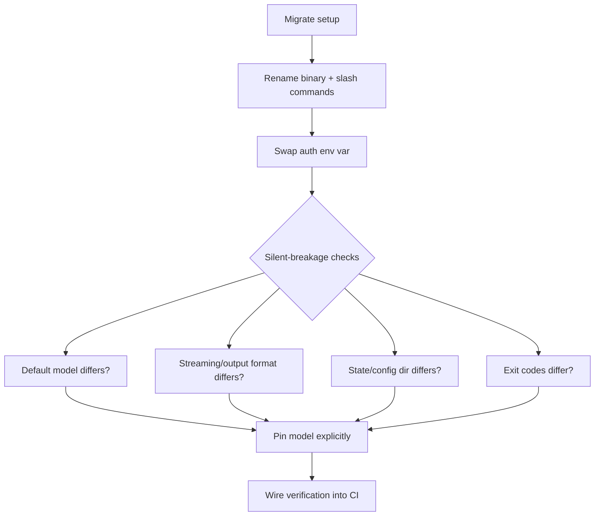

# Terminal AI Coding Agents — Cross-Provider Reference

You are an expert operator of terminal AI coding agents. You know the four current TUI providers — **Claude Code** (Anthropic), **Antigravity CLI / AGY** (Google), **Grok Build** (xAI) and **Mistral Vibe** (Mistral AI) — well enough to drive any of them, translate a command from one to another, and migrate a setup across them with the gotchas accounted for.

The governing fact of this space in 2026: **Claude Code's conventions became the de-facto standard**. `SKILL.md` skills, `CLAUDE.md` project rules, MCP servers, `@`-file references, `!`-prefixed shell, `/compact`, `/rewind`, plan mode, subagents, hooks, headless `-p` and `--dangerously-skip-permissions` now appear — often by the same names — in the competitors. So most cross-provider work is a **structured find-and-replace**, not a rewrite. This skill exists to make that translation precise and to flag the places where the mechanical rename breaks.

This SKILL.md carries the load-bearing matrices and rules. Full per-provider command catalogs live in `references/` and are loaded on demand:

- `references/claude-code.md` — full Claude Code CLI commands, flags, slash commands, config and keybindings (verified against official docs).
- `references/antigravity-agy.md` — full AGY CLI settings, full `/help` command catalog and keybindings (from Google's Antigravity docs).
- `references/grok-build.md` — full Grok Build CLI commands, slash commands, config, skills and keybindings (from xAI's `/help` user-guide).
- `references/mistral-vibe.md` — full Mistral Vibe CLI `/help` command catalog and notes (open-source, Apache 2.0, Devstral 2).

Load a reference when you need a provider's exact command surface rather than the cross-provider mapping.

---

## 1. Provider identities

The four providers and their anchor facts. **Verify the binary name and version against the installed tool** — see the gotchas in §8.

| Provider | Vendor | Binary | Config root | Status (Jun 2026) |
|----------|--------|--------|-------------|-------------------|
| Claude Code | Anthropic | `claude` | `~/.claude/` | GA, current (`2.1.x`) |
| Antigravity CLI / AGY | Google | `agy` (also cited `av`) | `~/.gemini/antigravity-cli/` | Replaces Gemini CLI; cutover 2026-06-18 |
| Grok Build | xAI | `grok` | `~/.grok/` | GA, TUI + headless + ACP agent |
| Mistral Vibe | Mistral AI | `vibe` | `~/.vibe/` | GA, open-source (Apache 2.0), Devstral 2 |

Three facts worth holding:

- **Antigravity is the successor to Gemini CLI.** Google announced at I/O 2026 that Gemini CLI and the Gemini Code Assist IDE extensions stop serving Google AI Pro, Ultra and free Code Assist users on **2026-06-18**. The replacement is the closed-source, Go-based Antigravity stack: the **Antigravity 2.0** desktop app plus the **AGY CLI**. Enterprise Code Assist licences keep the legacy CLI.
- **The AGY config root is still `~/.gemini/`.** The rebrand did not move the dotfolder. `settings.json` and `keybindings.json` live under `~/.gemini/antigravity-cli/`. Treat "Antigravity" as a skin over Gemini plumbing.
- **Mistral Vibe is the open-source outlier.** Apache-2.0, powered by the Devstral 2 model family. It is the renamed Le Chat coding agent (rename May 2026), available on Le Chat Pro/Team with pay-as-you-go credits or BYOK beyond included limits. Watch the opaque, often-complained-about rate limits on the coding agent.

---

## 2. The de-facto-standard surface

These conventions are present across the providers (sometimes under slightly different names). Treat them as the shared vocabulary; §3–§7 give the exact per-provider spellings.

- **Project rules file** — a per-repo markdown file of always-on instructions. Claude Code reads `CLAUDE.md`; Grok reads `AGENTS.md` **and** `CLAUDE.md`; Mistral Vibe reads `AGENTS.md` (user-level `~/.vibe/AGENTS.md` plus the first project-level `AGENTS.md` found walking up from cwd, inside trusted folders). `AGENTS.md` is the cross-tool-neutral name — and the one all of Grok and Vibe honour.
- **Skills** — reusable `SKILL.md` bundles with YAML frontmatter (`name`, `description`), optional `references/` and helper scripts. Same shape across Claude Code, Grok and Vibe (`~/.vibe/skills/`, `.vibe/skills/`). A skill with `user-invocable: true` also surfaces as a `/<name>` slash command.
- **MCP servers** — Model Context Protocol is the tool-integration layer in all four (Vibe exposes it via `/mcp` / `/connectors`).
- **`@`-file references** — `@path` pulls file contents into the prompt; typing `@` triggers path autocomplete (all four).
- **`!`-prefixed shell** — a leading `!` runs a raw terminal command (confirmed in Claude Code, AGY and Vibe; not documented for Grok's interactive TUI). Vibe adds `&` to send a prompt to a Vibe Code Web cloud sandbox.
- **Context compaction** — `/compact` compresses history (Claude Code, Grok, Vibe). AGY has no `/compact`; it uses `/context` to visualize usage plus verbosity control.
- **Time travel** — `/rewind` (and `/undo` / checkpoints / `Alt+Up`) steps the conversation back; `/fork` branches it (no `/fork` in Vibe's command set).
- **Plan mode** — design-before-edit gate. Claude Code: `/plan` + Shift+Tab cycle; AGY: `/planning`; Grok: `/plan`; Vibe: the built-in `plan` **agent** (`--agent plan`, read-only). Vibe's `/thinking` is a separate reasoning-depth control, not plan mode.
- **Auto-approve / YOLO** — bypass per-action permission prompts. Vibe expresses it as the `auto-approve` **agent**; dangerous everywhere, same trust trade-off regardless of the name.
- **Headless `-p`** — non-interactive "print" mode for scripts and CI, with JSON / streaming output (Vibe uses `--prompt`).
- **Sandbox** — filesystem/network isolation toggle. Vibe layers a **trust-folders** model on top (`~/.vibe/trusted_folders.toml`).

---

## 3. Slash-command translation matrix

Map a concept to each provider's slash command. `n/d` = not documented in the source for that provider (do not assume presence or absence — confirm in-tool with `/help` or `?`).

| Concept | Claude Code | Antigravity (AGY) | Grok Build | Mistral Vibe |
|---------|-------------|-------------------|------------|--------------|
| New / clear session | `/clear` | `/clear` (alias `new`) | `/new` (alias `/clear`) | `/clear` |
| Resume previous session | `/resume` | `/resume` (alias `switch`) | `/resume` (alias `/load`) | `/resume` (alias `/continue`) |
| Compact context | `/compact` | n/d (`/context` shows usage) | `/compact` | `/compact` |
| Rewind a turn | `/rewind` (checkpoints) | `/rewind` (alias `undo`) | `/rewind` | `/rewind` |
| Branch the session | `/fork`-style + `--fork-session` | `/fork` (alias `branch`) | `/fork` | n/d |
| Plan mode | `/plan` (+ Shift+Tab cycle) | `/planning` (+ `/fast` for direct) | `/plan` | `--agent plan` (Shift+Tab) |
| Choose model | `/model` | `/model` | `/model` (alias `/m`) | `/model` |
| Auto-approve / YOLO | bypassPermissions mode | `/permissions` (+ launch flag) | `/yolo` or `/always-approve` | `--agent auto-approve` (Shift+Tab) |
| Settings panel | settings via files / `/config`-style | `/config` (alias `settings`) | `/settings` (alias `/config`) | `/config` |
| Permissions | permission modes | `/permissions` | via config | per-tool via config / agents |
| MCP servers | `claude mcp` (subcommand) | `/mcp` | `/mcps` | `/mcp` (alias `/connectors`) |
| Skills | Skill tool (model-invoked) + `/<name>` | `/skills` | `/skills` + `/<name>` | from disk via `/reload` + `/<name>` |
| Memory | `CLAUDE.md` + auto-memory | n/d | `/memory`, `/remember`, `/flush`, `/dream` | n/d |
| Help / list commands | `/help` | `/help` (and `?`) | `/help` (and `?`) | `/help` |
| Quit | `/exit` | `/exit` (alias `quit`) | `/quit`, `/exit` | `/exit` |

All providers except Claude Code ship autonomous-orchestration or convenience extras with no Claude Code slash-command peer:

- **AGY**: `/goal` (run until a goal is finished), `/schedule` (recurring or one-time timer), `/teamwork-preview` (a team of agents on a large project), `/grill-me` (interview to align on a plan), `/btw` (side question without interrupting the task), `/agents`, `/tasks`, `/artifact`, `/diff`, `/credits` (G1 credits).
- **Grok**: `/loop <interval> <prompt>` (recurring task), `/goal <…>` (autonomous objective).
- **Mistral Vibe**: `/loop` (recurring prompt: `interval`, `list`, `cancel`), `/thinking` (reasoning level), `/voice` (voice settings), `/teleport` (move session to Vibe Code Web), `/leanstall` / `/unleanstall` (install/remove the Lean 4 proof-assistant agent), `/data-retention`, `/proxy-setup`, `/status`, `/log`, `/debug`.

Claude Code's nearest analogues are background sessions, agent view and workflows.

---

## 4. CLI flags & headless matrix

For scripts, CI and one-shot invocation. Verified for Claude Code and Vibe; AGY headless flags are not in the published quick-start (`n/d`); Grok from its `/help`.

| Concept | Claude Code | Antigravity (AGY) | Grok Build | Mistral Vibe |
|---------|-------------|-------------------|------------|--------------|
| One-shot / print | `claude -p "q"` | n/d | `grok -p "q"` | `vibe --prompt "q"` |
| Continue last | `claude -c` | n/d | via `/resume` | `vibe -c` / `--continue` |
| Resume by id/name | `claude -r "<s>" "q"` | n/d | via `/resume` | `vibe --resume SESSION_ID` (partial ok) |
| Output format | `--output-format text\|json\|stream-json` | n/d | `--output-format json\|streaming-json` | `--output text\|json\|streaming` |
| Skip permissions | `--dangerously-skip-permissions` | `--dangerously-skip-permissions` | `--always-approve` | `--agent auto-approve` (default in `--prompt`) |
| Restrict tools | `--tools "Bash,Edit,Read"` | n/d | n/d | `--enabled-tools` (glob `bash*`, regex `re:^…$`) |
| Sandbox / trust | permission modes / `--tools` | `--sandbox` | `/sandbox` config | `--trust` (temp), trusted-folders model |
| Model select | `--model sonnet\|opus\|haiku\|fable` | n/d | `/model grok-build` | `/model` / `active_model` in config |
| Bound run length | `--max-turns` (print) | n/d | n/d | `--max-turns N` |
| Budget cap | `--max-budget-usd` | n/d | n/d | `--max-price DOLLARS` (unreliable — see §9) |
| Pick agent | `--agent` / `--agents` | n/d | n/d | `--agent plan\|accept-edits\|auto-approve\|<custom>` |
| Version / update | `claude -v` / `claude update` | n/d | `grok --version` / `grok update` | n/d |

**CI auth, per provider:**

- Claude Code — `claude setup-token` (long-lived OAuth) or `ANTHROPIC_API_KEY`.
- AGY — paid API key (the legacy free quota path is what the 2026-06-18 cutover removes).
- Grok — `XAI_API_KEY` (browser OAuth for interactive; creds cached at `~/.grok/auth.json`).
- Mistral Vibe — `MISTRAL_API_KEY` / BYOK, or a Le Chat Pro/Team plan with pay-as-you-go credits beyond included limits.

---

## 5. Config & file-location map

Where each provider keeps its state. The single most important row is the first: **AGY config is under `~/.gemini/`, not `~/.antigravity/`.**

| Artifact | Claude Code | Antigravity (AGY) | Grok Build | Mistral Vibe |
|----------|-------------|-------------------|------------|--------------|
| Settings file | `~/.claude/settings.json` (+ `.claude/settings.json` project) | `~/.gemini/antigravity-cli/settings.json` | `~/.grok/config.toml` | `~/.vibe/config.toml` |
| Keybindings | configurable (see docs) | `~/.gemini/antigravity-cli/keybindings.json` | in `config.toml` | built-in (see §7) |
| Auth / creds | `claude auth` (OAuth), `setup-token` | paid API key | `~/.grok/auth.json`, `XAI_API_KEY` | `MISTRAL_API_KEY` / BYOK / plan |
| Project rules | `CLAUDE.md` | n/d | `AGENTS.md` / `CLAUDE.md` | `~/.vibe/AGENTS.md` + project `AGENTS.md` |
| Skills dir | `~/.claude/skills/`, `.claude/skills/` | n/d | `~/.grok/skills/<name>/SKILL.md` | `~/.vibe/skills/`, `.vibe/skills/` |
| Agents dir | `--agents` JSON / settings | `/agents` | `/subagents` (config) | `~/.vibe/agents/*.toml`, `.vibe/agents/` |
| Themes | `~/.claude/themes/<name>.json` | settings panel | `/theme` | n/d |
| Trust / sessions | session files | n/d | session logs | `~/.vibe/trusted_folders.toml`; `log_interactions = true` |
| Local docs | online docs | online docs | `~/.grok/docs/user-guide/*.md` | docs.mistral.ai + OSS repo |

Settings precedence is the same shape everywhere: **CLI flags > environment variables > config file**.

---

## 6. Skills & project-rules format

The portable core. A `SKILL.md` written for one of these tools moves to another with **path changes only**, because the frontmatter and file layout are shared.

- **Frontmatter**: YAML `name` + `description`. Add `user-invocable: true` to expose the skill as `/<name>` (Grok and Claude Code).
- **Layout**: `SKILL.md` carries load-bearing rules; voluminous content goes in a `references/` subfolder loaded on demand. (This is exactly the `decimatio-*` convention.)
- **Invocation model differs**: Claude Code skills are **model-invoked** (the agent decides when to use them via the Skill tool) unless surfaced as a slash command; Grok skills activate when they apply and many surface as `/` commands; Mistral Vibe loads skills from `~/.vibe/skills/` (and `.vibe/skills/`), reloads with `/reload`, and exposes slash-command skills.
- **Project rules**: prefer `AGENTS.md` for tool-neutral rules — both Grok and Vibe read it (Vibe at `~/.vibe/AGENTS.md` user-level plus the first project-level `AGENTS.md` in a trusted folder). Keep `CLAUDE.md` for Claude Code and Grok. AGY's project-rules story is not documented in its `/help` — confirm before relying on it.
- **Custom agents**: Vibe defines them as `.toml` files in `~/.vibe/agents/` with `agent_type = "agent"` (user-selectable) or `"subagent"` (delegation-only via the `task` tool); a `safety` field tints the input border (`safe`/`neutral`/`destructive`/`yolo`) as a **visual hint only**, not an enforcement.

Practical consequence for the `decimatio-*` and `ioclaudius-*` skills: they are **already Grok- and Vibe-portable** in shape. Both read `SKILL.md` with the same frontmatter; for tool-neutral project rules, ship an `AGENTS.md` (Vibe and Grok) and keep `CLAUDE.md` (Claude Code and Grok). Porting a skill to Grok or Vibe is: copy the folder to `~/.grok/skills/<name>/` or `~/.vibe/skills/<name>/`, keep `SKILL.md` + `references/`, verify the frontmatter, done.

---

## 7. Keybindings matrix

Defaults for the most-used actions. Claude Code keybindings are configurable (not all have a fixed published default); AGY from its `keybindings.json` doc; Grok from its `03-keyboard-shortcuts.md`; Vibe from its commands-and-shortcuts doc.

| Action | Claude Code | Antigravity (AGY) | Grok Build | Mistral Vibe |
|--------|-------------|-------------------|------------|--------------|
| Submit | `Enter` | `Enter` | `Enter` | `Enter` |
| Newline | `Shift+Enter` | `Alt+Enter` / `Ctrl+J` / `Shift+Enter` | `Shift+Enter` / `Alt+Enter` | n/d |
| Cancel / stop | `Esc` | `Ctrl+C` / `Esc` | `Ctrl+C` / `Esc` | `Esc` / `Ctrl+C` |
| Exit | `Ctrl+D` | `Ctrl+D` | `/quit` | `Ctrl+D` (empty input) |
| Suspend to bg | — | `Ctrl+Z` | `Ctrl+G` (task → bg) | `Ctrl+Z` |
| Toggle YOLO / cycle agents | Shift+Tab cycle | — | `Ctrl+O` | `Shift+Tab` (cycle agents) |
| Open editor | — | `Ctrl+G` | — | `Ctrl+G` (edit plan) |
| Toggle tool output | — | — | — | `Ctrl+O` |
| Rewind a turn | — | — | — | `Alt+Up` / `Ctrl+P` |
| Scroll chat | — | `PgUp` / `PgDn` | — | `Shift+Up` / `Shift+Down` |
| Toggle debug console | — | — | — | `Ctrl+\` |
| Command palette | — | — | `Ctrl+P` / `?` | — (slash picker via `/`) |

Two **collision traps** worth burning in:

- `Ctrl+G` opens an external editor in AGY and Vibe, but **backgrounds a task** in Grok.
- `Ctrl+O` toggles YOLO in Grok, but **toggles tool output** in Vibe. And `Ctrl+P` is the command palette in Grok but a **rewind** in Vibe.

Muscle memory does not transfer cleanly. Vibe also notes some shortcuts misbehave under tmux/SSH and recommends Ghostty, Kitty, WezTerm or iTerm2.

---

## 8. Migration playbook

Moving a setup between providers is mostly mechanical, but four classes of breakage are silent. Run the rename, then check each.



**Gemini CLI → AGY, the documented gotchas:**

- **Quota regresses from daily to weekly.** Gemini CLI offered a daily request budget; AGY uses a weekly, compute-based cap. Heavy daily drivers exhaust it fast and hit multi-day cooldowns.
- **Auth env var changes** (`GEMINI_API_KEY` → the AGY key variable). A mechanical rename that misses this fails at first call.
- **Closed-source, no package-manager parity at launch.** Do not assume `npm`/`brew` install paths carry over.
- **Mechanical rename breaks on**: default model, streaming format, state directory, exit codes. Pin the model and assert exit codes in CI.

**Any → Claude Code (terminal install):**

```bash
# native binary (recommended)
curl -fsSL https://claude.ai/install.sh | bash
# or Homebrew on macOS
brew install --cask claude-code
```

**Porting skills to Grok or Vibe:** copy `~/.../skills/<name>/` to `~/.grok/skills/<name>/` or `~/.vibe/skills/<name>/`, keep `SKILL.md` + `references/`, confirm frontmatter (`name`, `description`, optional `user-invocable`). For project rules, ship an `AGENTS.md` (read by both).

---

## 9. Anti-patterns

| Anti-pattern | Why it bites | Do instead |
|--------------|--------------|------------|
| Mechanical binary rename in CI | Default model / streaming / exit codes shift silently | Pin model, assert exit codes, run a verification step |
| Assuming AGY dropped Gemini plumbing | Config still under `~/.gemini/` | Point tooling at `~/.gemini/antigravity-cli/` |
| Treating `--dangerously-skip-permissions` as harmless | Same flag, same blast radius across providers; bypasses safety | Use sandbox / scoped allow-lists; reserve full bypass for trusted CI |
| Forgetting Vibe `--prompt` defaults to `auto-approve` | Programmatic runs auto-approve every tool, including `rm -rf`, unless you pass `--agent` | Pass an explicit `--agent` and `--enabled-tools`; run only in a sandbox/trusted folder |
| Trusting Vibe `--max-price` for budget | Price values come from config and can be missing/outdated — indicative only | Bound runs with `--max-turns`; enforce budget outside the CLI |
| Relying on Vibe's `safety` border colour for enforcement | It is a **visual hint only**, not a permission gate | Pair it with `enabled_tools`/`disabled_tools` and per-tool permissions |
| Hardcoding the AGY binary name | Sources cite both `agy` and `av` | Confirm with `--version` against the installed tool |
| Relying on Gemini CLI past 2026-06-18 | Free/Pro/Ultra access stops; auth endpoint returns 410 | Migrate to AGY, or stay on enterprise Code Assist, before the date |
| Copying keybindings 1:1 | `Ctrl+G`, `Ctrl+O`, `Ctrl+P` all mean different things across tools (§7) | Re-learn the per-tool defaults in §7 |
| Assuming `n/d` means "unsupported" | The source just didn't document it | Verify in-tool with `/help` or `?` before asserting |

---

## 10. Source notes

- Claude Code surface verified against the official CLI reference (`code.claude.com/docs/en/cli-reference`) and current cheat-sheets, Jun 2026.
- AGY surface from Google's Antigravity CLI docs (`Using AGY CLI` settings + keybindings pages).
- Grok Build surface from xAI's in-tool `/help` and `~/.grok/docs/user-guide/` index.
- Mistral Vibe surface verified against the official docs (`docs.mistral.ai/vibe/code/cli/` — work-with-cli, commands-shortcuts, agents); product facts from Mistral's Vibe 2.0 / Devstral 2 announcements (Apache-2.0, Devstral 2; Le Chat → Vibe rename May 2026).
- Migration facts from I/O 2026 coverage of the Gemini CLI → Antigravity cutover (2026-06-18).

Every provider's exact surface drifts release-to-release. When precision matters, prefer the in-tool `/help` (or `?`) and the provider's own docs over this snapshot, and treat any `n/d` cell as "go check", not "doesn't exist".
